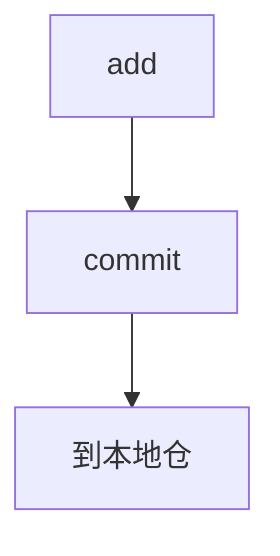
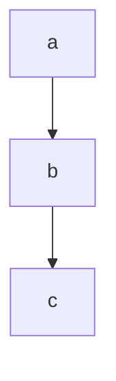

# 程序部任务一

## 1.github

### 0.准备工作  

一开始我的电信并不能打开github,当然我选择百度一下找到了解决方案。

1.找到hosts文件，复制到另外一个地方。

2.去一个叫做ipaddress的网站查IP。

3.#github

[自己查到的IP] github.com

[自己查到的IP] github.global.ssl.fastly.net

将以上的输入到hosts再粘贴回去，竟然真的可以上github

4.然而，打开git for windows的下载网页，还是会显示无法访问。

~~好在我又用移动解决了这个问题~~

### 1.开始使用github

- 对于github的理解

用来存代码的网盘，能查每个版本，还支持多人协同，感觉对于公司协作很有用。

- 开始使用github

*第一步当然是注册下载安装，再查查单词<Englisn difficult>*

跟着廖老师和各种b站视频总算学会从创建仓库到push前的任务

```github
$ git init
```




这样就可以继续把本地仓push了。

```github
$ ssh-keygen -t rsa -C "youremail@example.com"
$ git remote add origin git@github.com:michaelliao/learngit.git
```

在看清了每句话空格的位置，终于不报错之后，我还是败在了这句。

```github
$ git push -u origin master
```

每次执行完这句都会出现

```github
ssh:connect to host git.com port 22: Connection timed out
fata1: Could not read from remote repository 
please make sure you have the correct access rights and the repository exists
```

不知道为什么ssh协议还是不行，用https协议终于完成了push

我先进行了远程管理的学习再进行修改。

用git status 检测修改，用diff看到不同，还可以回退到任意版本。


### 2.体会

- github的特点在于可以记录每次修改，可以退到某个版本，可以和其他人进行协作。
- 个人体会：命令记清楚，尤其是哪里有空格。遇到问题学会检查，百度,csdn是个好东西。
- patient!

***

## 2.Markdown

### 0.对Markdown理解

升级版的word？？？学起来很快，很好用，记笔记应该很好。

### 1.所学展示

#### 1.标题

# 我是标题1

## 我是标题2

### 我是标题3

***

#### 2.代码块：

```java
class Javahelloworld {
    public static void main(String args[]){
        System.out.println("hello world\n");
    }
}
```

***

#### 3.字体

**加粗**

~~删除线~~

*斜体*

> 引用                 

==highlight==

***


#### 4.分割线

---

***

#### 5.图片插入


***


#### 6.超链接

[百度一下]（https://www.baidu.com/）

***


#### 7.小圆点

-   小圆点              

***


#### 8.数学符号

$$
y=x^2
$$

***

#### 9.字体格式调节

<font face="微软雅黑" >微软雅黑字体</font>
<font face="黑体" >黑体</font>
<font size=3 >3号字</font>
<font color=#FF0000 >红色</font>

***

#### 10.高亮不同颜色调节

<table><tr><td bgcolor=#7FFFD4>我喜欢的颜色</td></tr></table>

> 各种颜色代码http://www.voidcn.com/article/p-firwkkkw-vc.html

***

#### 11.表格

| 成绩 | 语文 | 数学 |
| ---- | ---- | ---- |
| 张三 | 100  | 100  |
| 李四 | 100  | 100  |

***

#### 12.流程图



## 3.未来展望

1.想做后端开发，学习js,python,以及一些数据处理的知识。

2.学习计算框架和大数据存储。

3.做一些简单易用的小程序。

​                                                                                     


